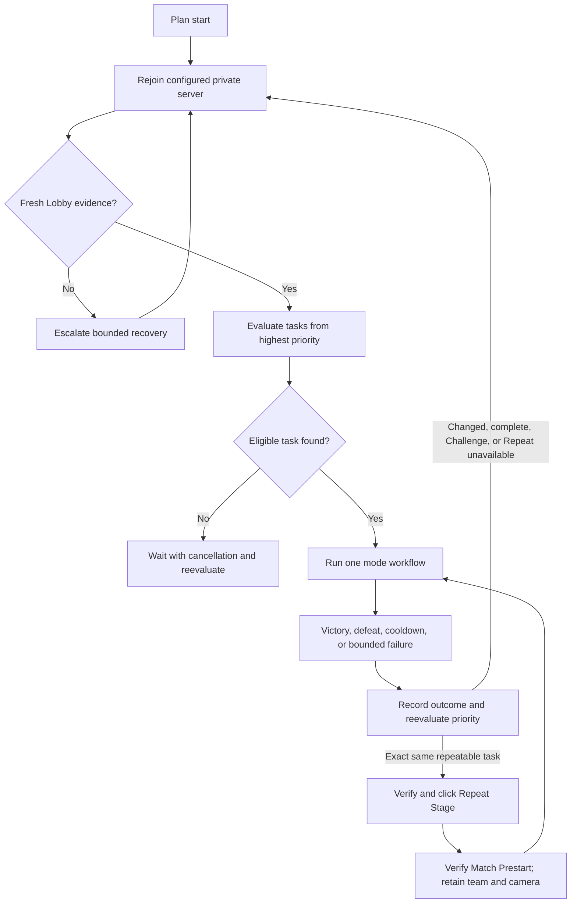

# Macro architecture

**Status: Prototype.** The Story/Raid/Challenge/Expedition scheduler, Villain Invasion Acts 1-4, shared placement/terminal path, verified private-server Lobby reset, persistent Plan authoring, and DPAPI secret persistence are Prototype.

## Root model

Lobby is the canonical entry and task-change root state. The Plan page configures independent tasks with explicit priority; visual order means priority, not a consecutive script. After every completed or failed match attempt, the scheduler records the outcome and reevaluates eligibility from the highest priority. An exact same-task Story, Raid, Expedition, or Event selection may continue through Repeat Stage; Story Infinite instead uses its verified in-match Restart and already returns to Match Prestart. Any task, act, or mode change returns through verified Lobby.

Repeat Stage is a bounded fast path, not a competing scheduler. It is authorized only after a typed terminal outcome and a fresh priority decision select the exact same Story, Raid, Expedition, or Event task. The continuation verifies fresh Match Prestart/Start Game evidence and reruns mode-specific preparation without team selection or camera alignment because Roblox retains both. Story Infinite has no result-screen continuation: two fresh counter observations authorize the shared Settings Restart path, which verifies Match Prestart before the scheduler accounts a completed run and reevaluates. Resetting through Lobby remains mandatory for task/act/mode changes, completion, Challenge, Tower when implemented, and Repeat/Restart failure.

## Execution target

Every macro UI executes on its own Windows desktop. The main account can run directly, while each optional runner account receives the same full UI inside a loopback-only RDP session. The main UI manages accounts/viewports but does not publish work or forward input to them. Shared runners point at one ACL-restricted configuration root; separate runners receive independent roots. Each instance independently verifies Roblox, capture freshness, Lobby, settings/UI scale, and input ownership before acting. See [Local instance manager](LOCAL-SESSION.md).

## Scheduler contract

Each task will declare:

- enabled state and priority;
- eligibility policy such as cooldown, target count, or stop condition;
- mode-specific target configuration;
- team and placement route references;
- retry and failure budget;
- completion accounting.

The scheduler evaluates a stable snapshot from highest to lowest priority, runs at most one task, records the terminal outcome, and immediately reevaluates priority. Every eligibility predicate in one selection pass receives the same captured observation time; the scheduler never compares a prior `now` against a later fallback timestamp. When every bounded task in a loop reaches its target, the scheduler records one completed loop run. A repeating finite loop clears its bounded child counters until its configured run count is reached; a Forever loop clears them after every completed run and immediately makes its first child eligible again. Completed finite loops no longer participate in selection. If the same supported task remains selected it may use Repeat Stage; otherwise it resets to Lobby before the next task. The terminal decision and its same-task, mode, pending-code, and next-task inputs are recorded in deep debug before any result action, and each loop boundary records its loop name and completed-run count. A run-scoped exact-team cache avoids reopening Teams when a later task requests the team already verified during the same uninterrupted user-started run; every manual stop/start resets that knowledge to unknown. It must remain cancellation-aware and must never hold Roblox input while waiting for eligibility.

Every plan start and private-server reset begins by closing Roblox in the owning Windows session, atomically normalizing the explicit UI/input allowlist in that profile's Roblox settings file, opening the validated private-server link, and obtaining fresh Lobby evidence. It then normalizes the rendered UI scale. The displayed numeric value is only a calibration input: the runtime measures panel geometry, applies bounded reciprocal feedback, and validates the result. A per-user/per-Windows-session cached candidate is a revalidated hot-path hint, not evidence. These runtime-owned invariants are never optional user settings.

## Unattended continuity contract

The public-release objective is that a configured run does not terminate because an ordinary visual, timing, Roblox, network, or task anomaly occurs while the user is away. Normal terminal conditions are an explicit user stop, invalid or incomplete user configuration detected before safe execution, an unsupported setup/environment that cannot start safely, or external process/OS termination. Safety failures stop the current action and release input; they do not silently end the scheduler.

Recovery is an indefinitely available scheduler-level escalation made from individually bounded, cancellable episodes:

1. release all input, reacquire Roblox, and expand the bounded temporal observation window using fresh evidence;
2. reopen the configured private server, restore canonical client geometry and required game/UI settings, and verify Lobby;
3. restart Roblox, reacquire it, normalize settings again, and verify Lobby;
4. quarantine the failing task with an inspectable reason, continue with the next eligible task, and periodically reconsider quarantined work under a bounded backoff policy;
5. when no task is currently safe or eligible, wait without holding input and repeat recovery until cancellation or configuration changes.

The current Prototype preflights every configured task and placement route before runtime input begins. A bounded placement selection-proof miss is handled inside the match: the target is freshly reselected at most three times, then the authored step is logged as skipped and the next step continues without restarting Roblox. A safe-dismissal failure, capture/input failure, invalid state, or other operational exception returns to the scheduler instead of ending the Macro: retries wait 2, 5, 15, then at most 30 seconds; the reset path restarts Roblox, reapplies normalization, rejoins the private server, and verifies Lobby. Three consecutive failures attributed to one task quarantine it for 5 minutes, allowing another eligible task to run; an otherwise idle plan waits and periodically reconsiders that task. Managed-session execution uses the same capped 2/5/15/30-second operational retry ladder around a fresh full-plan reset, while invalid serialized configuration remains terminal. Each recovery and quarantine is written to the run log and deep-debug events. Owner live acceptance and broader anomaly classification remain required before this objective can be promoted beyond Prototype.

“Indefinitely available” never means infinite clicking, an unbounded wait inside one state owner, stale evidence, or bypassing a safety gate. Each observation window, input attempt, transition, restart, and cleanup remains capped. Fresh evidence must authorize every input, cancellation must interrupt every layer, and held keys/buttons must be released before any retry, restart, quarantine, or wait. Recovery history, task quarantine, and the active escalation level must remain visible in diagnostics.

## Shared modules

| Module | Planned owner |
|---|---|
| Session reset | Open the protected private-server link, reacquire Roblox, standardize client geometry, verify Lobby |
| State evidence | Combine current OCR rules with future personalized image detection and expose inspectable confidence/evidence |
| Input coordinator | Grant one workflow exclusive, cancellable Roblox input ownership and guarantee release |
| Team selection | Lobby to Unit Inventory to Teams, bounded scroll, Load/Confirm/Include flow |
| Root navigation | Lobby to Play, Events, Areas, or another verified root destination |
| Mode navigation | Map, act, difficulty, challenge type, or limited-event selection |
| Match start | Match Preview, Match Prestart, and Start Game boundary handling |
| Placement playback | Execute the selected validated route before and after Start Game |
| Terminal handling | Detect Victory, Defeat, cooldown, timeout, or fatal ambiguity and return an outcome to the scheduler |
| Persistence and reporting | Atomically autosave Plan state; protect secrets, redact diagnostics, and optionally send bounded webhooks |
| Signed control state | Independently poll and verify public maintenance, disablement, schedule, and active-code snapshots in each Macro UI; never treat the service as an input owner |

Modules exchange typed state/outcome contracts rather than clicking through one another. Every handoff requires fresh evidence for the owned state.

At each verified Lobby reset, the scheduler applies any active signed public codes that have not yet completed during this user-started run. The code launcher and Codes panel are independent dataset-owned states. Opening either uses the shared destination-first temporal transition contract, text entry accepts only the bounded game-code alphabet and preserves case, and three fresh panel-owned Redeem actions are followed by the shared Areas-UI respawn cleanup. Publishing a code while an exact task is repeating suppresses the next Repeat Stage fast path so the normal Lobby reset can process it. Manual Stop/Start deliberately clears the in-memory attempted-code set.

Placement routes preserve every authored prestart action in order. The game no longer supplies a timer-driven auto-start fallback, so the `Start Game` boundary requires a fresh verified action before the owner can continue into after-start actions. Individual Delay and post-step values retain their ordinary bounded validation; there is no timer-derived aggregate prestart budget.

## Mode flows

All arrows below mean a verified transition, not a timed blind click.

### Story — Prototype

Acts 1-5 and Mastery: Lobby -> Unit Inventory -> Teams -> change team -> Play UI -> Story map -> Story act and supported difficulty -> Match Preview -> Match Prestart -> prestart placements -> Start Game -> after-start placements -> Victory/Defeat -> exact same task: Repeat Stage -> verified Match Prestart with retained team/camera; otherwise private-server rejoin -> Lobby.

Infinite: the same path through placements and Start Game -> bounded wave-counter observations -> two fresh structurally corroborated readings at or above the configured wave -> Settings -> Restart -> Confirm -> verified Match Prestart. One verified reset counts as one task run. If the same task remains eligible, playback continues from that prestart state with the retained team/camera; a changed or completed task returns through Lobby.

### Raid — Prototype

Lobby -> Unit Inventory -> Teams -> change team -> Play UI -> Raid map -> Raid act -> Match Preview -> Match Prestart -> prestart placements -> Start Game -> after-start placements -> Victory/Defeat -> exact same task: Repeat Stage -> verified Match Prestart with retained team/camera; otherwise private-server rejoin -> Lobby.

### Challenge — Prototype

Lobby -> Unit Inventory -> Teams -> change team -> Play UI -> Challenge type or cooldown outcome -> Match Preview -> Match Prestart -> prestart placements -> Start Game -> after-start placements -> Victory/Defeat -> private-server rejoin -> Lobby.

Challenge does not use Repeat Stage; its eligibility is reevaluated after the Lobby reset. Enabled types run in Trait, Stat, Sprite order and are attempted at most once per global half-hour epoch. A cooldown observation blocks that type until the next reset. If the same type is still cooling down after the epoch advances, that type is treated as having reached its 10/10 daily limit until UTC midnight. Availability clears the prior cooldown evidence. Other enabled types remain independently eligible.

The random Challenge map is recognized after type selection and selects the corresponding Story map's `challenge` placement route. Because team selection happens before the random map is known, all five effective Challenge routes must use one common team; disagreement fails before Roblox input.

### Expedition — Planned

Lobby -> Unit Inventory -> Teams -> change team -> Play UI -> Expedition map and difficulty -> Match Preview -> route-reward inspect/reroll -> Match Prestart -> current-node loop -> Checkpoint extraction or terminal result -> exact same task: Repeat Stage -> fresh Start Game -> route optimization and new-match placements; otherwise private-server rejoin -> Lobby.

The node loop locates and hovers only the current marker. A stable tooltip title owns semantic calibration, while the color learned from that observation is a per-environment hot path with hover-OCR fallback and refresh. Future-node lookahead is not required. Defense and Elite wait for Start Game before replaying placement/configuration. Once a placement probe shows no selection UI, that placement is retained as physical and omitted from later Defense/Elite replay probes for the rest of the match; a replacement phantom remains eligible and receives its saved configuration. Assault and Boss wait; Encounter and non-spawn Checkpoint wait for ship arrival and then use separate verified Continue source/modal states; Checkpoint applies extraction policy. The detailed field contract and unresolved behavior are in [Expedition runtime](EXPEDITION-RUNTIME.md).

### Event — Prototype

Lobby -> Unit Inventory -> Teams -> change team -> Events -> Villain Invasion -> OCR-owned Act 1-4 card -> Select Stage -> Match Preview -> Match Prestart -> camera alignment -> first-load map preparation -> placements -> Start Game -> Victory/Defeat -> exact same task: Repeat Stage with retained team/camera/player position; otherwise private-server rejoin -> Lobby.

Map preparation is a shared map-identity policy rather than Event-specific orchestration, so future maps can register bounded key sequences without duplicating the match runner. Repeat Stage always bypasses preparation.

The updated Event sidebar also exposes Boss Bounty and Guess That Unit through the same live-OCR destination selector. Their downstream flows remain unspecified, so only owner-triggered Debug selection is implemented; neither is treated as a runnable Event task yet.

## Content lifecycle

- Story, Raid, Challenge, and Expedition are permanent game modes. Their runners own only mode-specific navigation and reuse the shared team, match-start, placement, terminal, and Lobby-reset modules.
- Event acts are limited content. Each event definition must keep its identity, OCR aliases, routes, availability, and runner adapter behind one removable registration boundary instead of adding branches throughout the scheduler and UI.
- Utilities are scheduler tasks, not game modes. They use the same priority contract but remain separate from mode navigation. Mine and Drill may retain independent configured minute intervals or use one combined task whose clock begins only after the separate Mine and Drill workflows both finish. Gold Shop and Calendar use the next UTC midnight, Raid Shop uses the next seven-day boundary from its field-supplied beacon, and Expedition Shop uses a two-day boundary from that beacon. Shop task snapshots carry only stable enabled-item IDs, never screen positions; the runtime rediscovers catalog rows and availability from fresh evidence.
- Removing limited content must delete its registration and focused tests without changing shared capture, OCR, input, placement, terminal, or scheduler services. Persisted plan modes use exact stable names and reject unknown values rather than silently deserializing as another mode; an unavailable-content state is still required before a persisted limited Event task can outlive its registration.

## State-transition safety

Every runner must:

1. enter from verified Lobby or a typed state handed off by a shared module;
2. take fresh evidence before input;
3. require the intended live target or verified relational layout;
4. cap waits, retries, scrolling, and input attempts;
5. revalidate Roblox after delays and external navigation;
6. return a typed success, cooldown, defeat, retryable failure, or fatal failure;
7. release input on cancellation and every exception path.

Every ordinary input transition also follows one shared temporal contract. The owner observes the expected destination first. If it is present, the transition completes without checking the previous state. If it is absent, the owner observes the source: a retained source authorizes reacquiring its live action and one bounded retry; neither state authorizes only an expanding bounded observation delay, never input. A local episode eventually returns success or a typed retryable failure, while the scheduler owns indefinite recovery. Multi-destination branches check every valid expected state before the source. Any exception must document why a destination cannot be independently owned and what bounded evidence replaces it.

OCR, image detection, and timers may suggest a state. None may authorize input without the state's complete evidence contract.

## Persistence and secrets

**Prototype:** Plan edits, selection, Discord failure options, and the default-off diagnostic-upload consent autosave through a serialized queue to a schema-versioned atomic settings file; invalid plan payloads fail closed to the built-in defaults without discarding separately valid settings. Private-server and webhook values are masked in Settings and persisted only as current-user DPAPI ciphertext. Validated web/share links are reduced to bounded share/link codes and launched through the registered `roblox://` protocol without a browser intermediary. Test Webhook performs a bounded, mention-free delivery to the validated Discord endpoint. Terminal failure notifications always include failure details; runtime-triggered delivery remains Planned. Persisted secrets remain redacted from diagnostics, logs, tests, and captures. Diagnostic consent permits only a new explicit archive selection and never schedules automatic upload. **Planned:** runtime webhook delivery and explicit recovery UX for DPAPI data that cannot be decrypted.

## Unresolved design work

- Macro dashboard and run controls
- Eligibility/cooldown policies and completion counters
- Runtime detector model and confidence calibration
- Placement success and unit-state detection
- Settings grouping and protected-secret lifecycle
- Packaging, recovery after application restart, and releases
